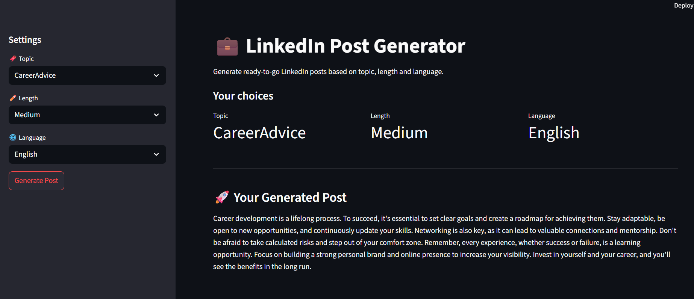

# LinkedIn Post Generator

An intelligent LinkedIn post generation tool that analyzes an influencer's writing style and generates new posts matching their tone, topics, and engagement patterns using RAG (Retrieval-Augmented Generation) and LLM technology.



## 🚀 Features

- **Style Analysis**: Extracts writing patterns from existing LinkedIn posts
- **Topic Extraction**: Automatically identifies key topics from historical posts
- **Multi-language Support**: Supports English and Hinglish (Hindi + English mix)
- **Customizable Length**: Generate short, medium, or long posts
- **Few-shot Learning**: Uses similar posts as examples for better style matching
- **Real-time Generation**: Fast post generation using Groq Cloud API

## 🏗️ Architecture

The project follows a two-stage architecture:

### Stage 1: Pre-processing
1. **Data Collection**: Manually collect LinkedIn posts (can be automated with web scraping)
2. **Data Enrichment**: Extract metadata using LLM:
   - Topics/Tags (max 2 per post)
   - Language detection (English/Hinglish)
   - Line count analysis
3. **Tag Unification**: Standardize similar tags (e.g., "job search", "job hunting" → "Job Search")

### Stage 2: Post Generation
1. **Topic Selection**: User selects topic, length, and language
2. **Few-shot Retrieval**: Find similar posts for context
3. **Prompt Engineering**: Create optimized prompts with examples
4. **LLM Generation**: Generate new post using Llama 3.2 via Groq

## 🛠️ Tech Stack

- **Backend**: Python 
- **LLM**: Llama 3.2 (90B) via Groq Cloud
- **Framework**: LangChain for LLM orchestration
- **Frontend**: Streamlit for web interface
- **Data Processing**: Pandas, JSON
- **Environment**: python-dotenv for configuration

## 📋 Prerequisites

- Python 3.10+
- Groq Cloud Account (free tier available)
- Basic understanding of Python and LLMs

## 🔧 Installation

1. **Clone the repository**
```bash
git clone <repository-url>
cd linkedin-post-generator
```

2. **Install dependencies**
```bash
pip install -r requirements.txt
```

3. **Set up environment variables**
Create a `.env` file in the root directory:
```env
GROQ_API_KEY=your_groq_api_key_here
```

4. **Get Groq API Key**
   - Visit [Groq Cloud](https://console.groq.com)
   - Create account and generate API key
   - Copy the key to your `.env` file

## 📁 Project Structure

```
linkedin-post-generator/
├── data/
│   ├── raw_posts.json          # Original LinkedIn posts
│   └── processed_posts.json    # Enriched posts with metadata
├── app.py                     # Streamlit UI application
├── pre_process.py              # Data preprocessing pipeline
├── post_generator.py          # Post generation logic
├── few_shot.py               # Few-shot learning utilities
├── llm_helper.py             # LLM integration
├── .env                      # Environment variables
└── requirements.txt          # Python dependencies
```

## 🚀 Usage

### 1. Prepare Data

Create `data/raw_posts.json` with your LinkedIn posts:
```json
[
  {
    "text": "Your LinkedIn post content here...",
    "engagement": 1234
  }
]
```

### 2. Preprocess Data

```bash
python preprocess.py
```
This will:
- Extract topics, language, and line counts
- Unify similar tags
- Create `processed_posts.json`

### 3. Run the Application

```bash
streamlit run app.py
```

### 4. Generate Posts

1. Select topic from dropdown
2. Choose post length (Short: 1-5 lines, Medium: 6-10 lines, Long: 11+ lines)
3. Pick language (English/Hinglish)
4. Click "Generate" button

## 🔍 How It Works

### Data Preprocessing
```python
# Extract metadata using LLM
def extract_metadata(post_text):
    prompt = """
    Extract from this LinkedIn post:
    1. Line count
    2. Language (English/Hinglish)  
    3. Max 2 relevant tags
    Return as JSON.
    """
    # LLM processes and returns structured data
```

### Few-shot Learning
```python
# Retrieve similar posts for context
def get_filtered_posts(length, language, tag):
    filtered_df = df[
        (df['length'] == length) & 
        (df['language'] == language) & 
        (df['tags'].apply(lambda x: tag in x))
    ]
    return filtered_df.to_dict('records')
```

### Post Generation
```python
# Generate new post with examples
def generate_post(length, language, topic):
    examples = get_filtered_posts(length, language, topic)
    prompt = f"""
    Generate LinkedIn post:
    Topic: {topic}
    Length: {get_length_description(length)}
    Language: {language}
    
    Use writing style from examples:
    {format_examples(examples)}
    """
    return llm.invoke(prompt)
```

## 🎯 Key Features Explained

### Intelligent Tag Unification
- Merges similar tags like "job hunting", "job search" → "Job Search"
- Uses LLM to understand semantic similarity
- Maintains consistent tagging across posts

### Length Standardization
- **Short**: 1-5 lines
- **Medium**: 6-10 lines  
- **Long**: 11+ lines
- Provides explicit line counts to LLM for better control

### Language Detection
- **English**: Standard English posts
- **Hinglish**: Mix of Hindi and English (common in Indian social media)
- Maintains script consistency (always English characters)

### Few-shot Retrieval
- Finds posts matching topic, length, and language
- Uses up to 2 examples for context
- Fallback to general generation if no examples found

## 🔒 Data Privacy

- Posts are processed locally
- Only prompts sent to Groq Cloud
- Original content stays on your machine
- API keys stored securely in environment variables

## 🚀 Extending the Project

### Automated Data Collection
- Integrate with LinkedIn API
- Use web scraping tools like Bright Data
- Implement automated post monitoring

### Enhanced Features
- Engagement prediction
- Optimal posting time suggestions
- A/B testing for post variations
- Multi-platform support (Twitter, Facebook)

### Advanced Customization
- Fine-tune prompts for specific industries
- Add more sophisticated style analysis
- Implement feedback loops for continuous improvement

## 🐛 Troubleshooting

### Common Issues

1. **Groq API Key Error**
   - Verify key is correct in `.env` file
   - Check Groq account status and limits

2. **No Examples Found**
   - Ensure processed data has posts matching your criteria
   - Try different topic/length combinations

3. **Poor Quality Generation**
   - Add more training posts
   - Improve tag unification
   - Adjust few-shot examples count

## 📊 Performance Metrics

- **Processing Speed**: ~2-3 seconds per post generation
- **Style Accuracy**: Depends on training data quality
- **Topic Coverage**: Limited to influencer's historical topics
- **Cost**: Free tier sufficient for moderate usage

## 🤝 Contributing

1. Fork the repository
2. Create feature branch (`git checkout -b feature/amazing-feature`)
3. Commit changes (`git commit -m 'Add amazing feature'`)
4. Push to branch (`git push origin feature/amazing-feature`)
5. Open Pull Request

## 📄 License

This project is licensed under the MIT License - see the [LICENSE](LICENSE) file for details.

## 🙏 Acknowledgments

- Groq Cloud for fast LLM inference
- LangChain for LLM orchestration
- Streamlit for rapid UI development

## 📞 Support

For questions and support:
- Create an issue in the repository
- Check the troubleshooting section
- Review Groq documentation for API issues

---

**Note**: This tool is designed for educational and productivity purposes. Always respect LinkedIn's terms of service and maintain authenticity in your social media presence.